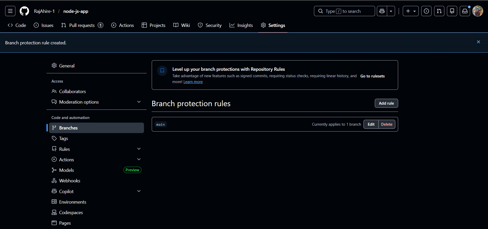
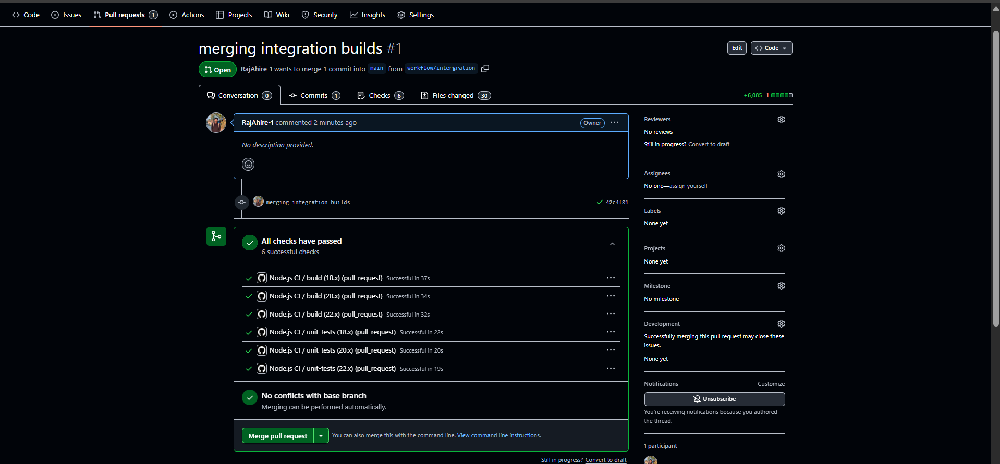
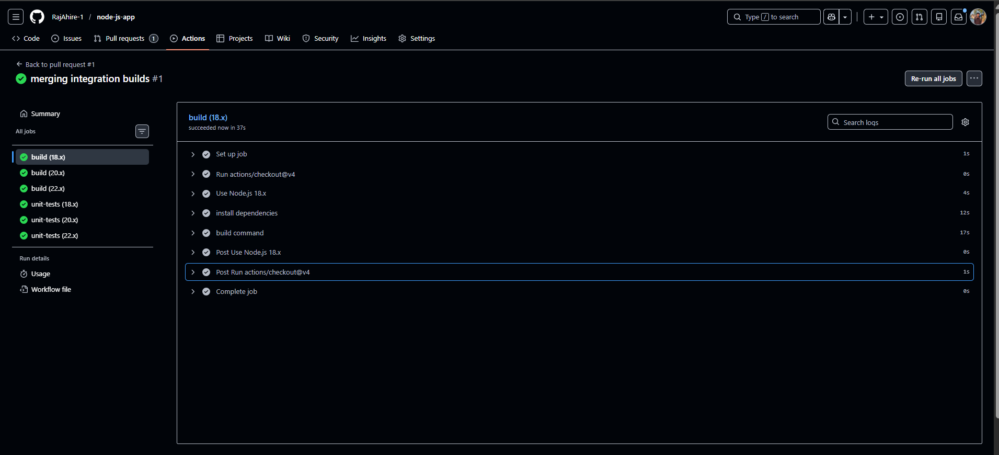
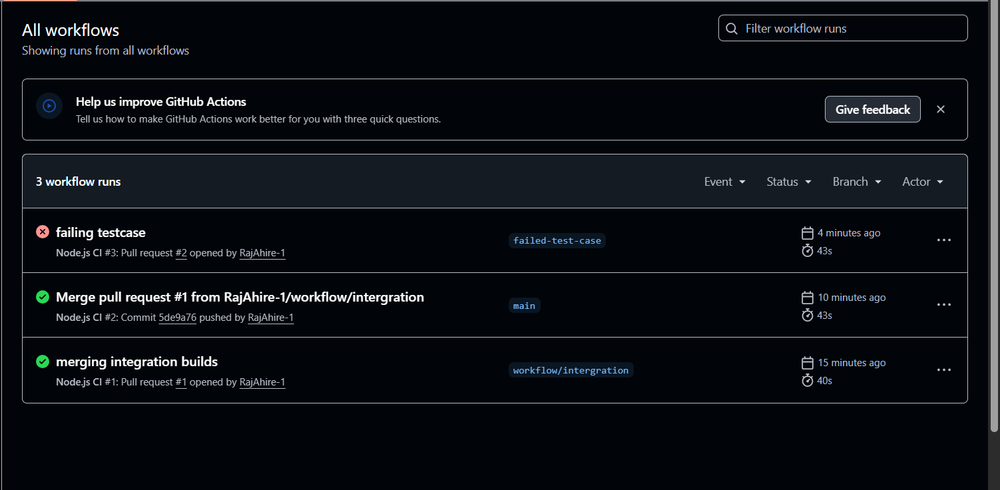
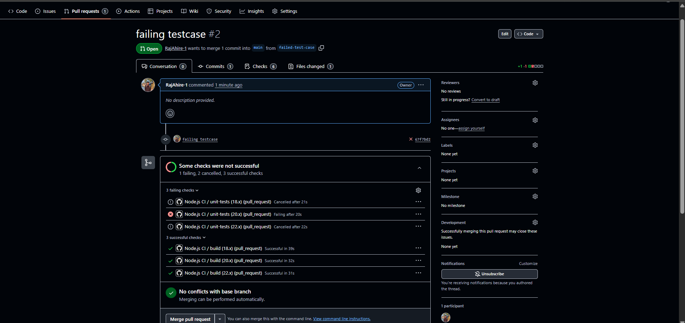
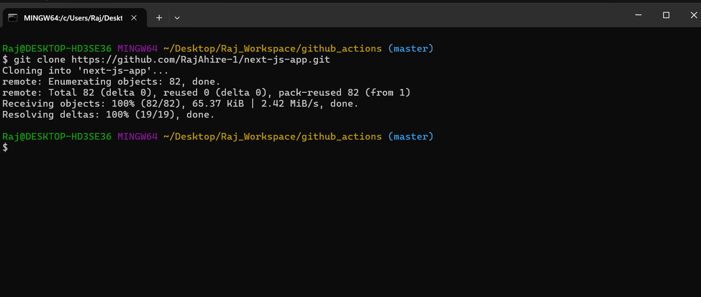
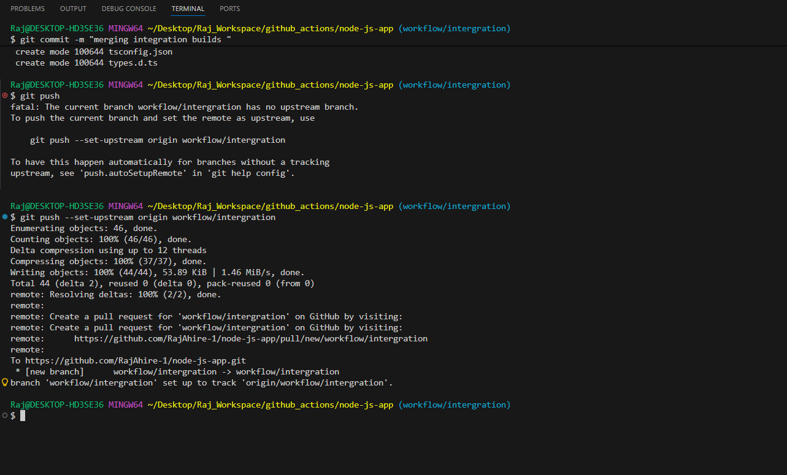

# 🚀 GitHub Actions CI Pipeline for Node.js Application

This repository demonstrates a **production-ready Continuous Integration (CI) pipeline** built using **GitHub Actions** for a Node.js application.

The pipeline is designed to ensure that **every code change is automatically built and tested** before it can be merged into the `main` branch.

---

## 🔍 Overview

In real-world software development, manually testing code before every merge is risky and unreliable.  
This CI pipeline solves that problem by automatically validating code through builds and unit tests.

### What this pipeline ensures

- Code builds successfully
- Unit tests pass on multiple Node.js versions
- Broken code cannot reach the `main` branch
- Developers get fast feedback via Pull Requests

---

## 🎯 Why This CI Pipeline Exists

Without CI:
- Bugs may enter production
- Code may work on one Node.js version but fail on another
- Manual testing slows down development

With CI (this project):
- Every Pull Request is automatically verified
- Compatibility issues are caught early
- Code quality is enforced by automation

---

## 🏗️ CI Architecture

```text
Developer Push / Pull Request
            │
            ▼
     GitHub Repository
            │
            ▼
   GitHub Actions Workflow
            │
            ├── Build Job
            │     ├─ Node.js 18.x
            │     ├─ Node.js 20.x
            │     └─ Node.js 22.x
            │
            ├── Unit Test Job
            │     ├─ Node.js 18.x
            │     ├─ Node.js 20.x
            │     └─ Node.js 22.x
            │
            ▼
   Status Checks on Pull Request
            │
     ┌──────┴────────┐
     │               │
 ❌ Failure       ✅ Success
 Merge Blocked    Merge Allowed
````

---

## ⚙️ How the CI Pipeline Is Created

The CI pipeline is defined using a GitHub Actions workflow file named:

```
integration.yml
```

### Step-by-step logic

1. **Trigger**

   * The workflow runs automatically when a Pull Request is created or updated.

2. **Matrix Strategy**

   * The same jobs run on multiple Node.js versions:

     * `18.x`
     * `20.x`
     * `22.x`
   * This ensures compatibility across environments.

3. **Build Job**

   * Installs dependencies
   * Runs the build command
   * Fails immediately if the build breaks

4. **Unit Test Job**

   * Runs automated tests
   * Ensures application logic is correct
   * Prevents faulty code from being merged

---

## 🔐 Branch Protection (Quality Gate)

To make CI effective, **branch protection rules** are applied to the `main` branch.

### Rules Applied

* Direct pushes to `main` are disabled
* All changes must go through a Pull Request
* All GitHub Actions checks must pass

This guarantees that **CI results control the merge process**, not humans.



---

## ✅ Successful Pipeline Execution

When:

* All build jobs succeed
* All unit tests pass
* No conflicts exist

GitHub enables the **Merge** button.







---

## ❌ Failing Test Case (Proof of CI Enforcement)

This project also demonstrates a **real failing scenario**.

When a unit test fails:

* The workflow reports failure
* Remaining jobs may be cancelled
* Merge is automatically blocked



This proves that the CI pipeline is **actually enforcing quality**, not just running jobs.

---

## 🧑‍💻 Developer Workflow

### Clone Repository

```bash
git clone https://github.com/RajAhire-1/node-js-app.git
```



---

### Push Feature Branch

```bash
git push --set-upstream origin workflow/integration
```



Once pushed:

* Pull Request is opened
* CI runs automatically
* Merge depends on CI result

---

## 🧠 Key Learnings

* CI should block broken code automatically
* Testing across versions prevents runtime issues
* Branch protection makes CI meaningful
* GitHub Actions is suitable for production workflows

---

## 🏆 Skills Demonstrated

* GitHub Actions
* CI Pipeline Design
* Node.js Build & Unit Testing
* Branch Protection Rules
* DevOps Best Practices

---

## 👤 Author

**Raj Ahire**
DevOps | Cloud | CI/CD


