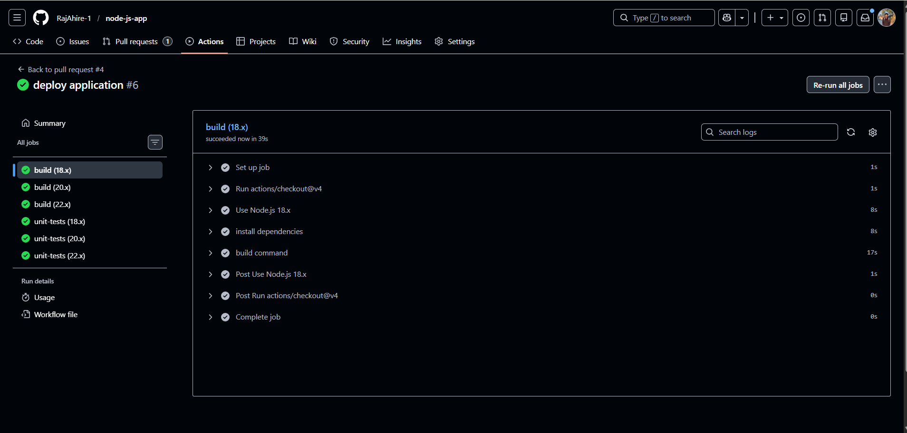
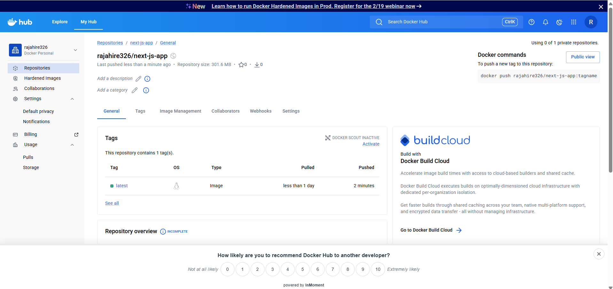

# GitHub Actions CI/CD Pipeline for Node.js Application

This repository demonstrates a production-grade Continuous Integration and Continuous Deployment (CI/CD) pipeline implemented using GitHub Actions for a Node.js application.

The pipeline ensures that all code changes are validated through automated builds and tests before merge, and that the application is packaged as a Docker image and published to Docker Hub after merge.

---

## Overview

This project implements a complete CI/CD workflow with the following objectives:

- Enforce automated validation before code merge
- Protect the main branch from unstable code
- Test application compatibility across multiple Node.js versions
- Automatically build and publish Docker images
- Maintain a reliable and repeatable delivery process

---

## CI/CD Architecture

```text
Developer Push / Pull Request
            |
            v
     GitHub Repository
            |
            v
   GitHub Actions (CI Workflow)
            |
            |-- Build Job
            |     |-- Node.js 18.x
            |     |-- Node.js 20.x
            |     |-- Node.js 22.x
            |
            |-- Unit Test Job
            |     |-- Node.js 18.x
            |     |-- Node.js 20.x
            |     |-- Node.js 22.x
            |
            v
   Pull Request Status Checks
            |
        +---+---+
        |       |
     Failure   Success
   Merge Blocked
            |
            v
      Merge to main branch
            |
            v
   GitHub Actions (CD Workflow)
            |
            |-- Docker Image Build
            |-- Docker Hub Authentication
            |-- Docker Image Push
            |
            v
        Docker Hub Repository
````

---

## Continuous Integration (CI)

### Workflow Configuration

* Workflow file: `integration.yml`
* Trigger: Pull requests targeting the `main` branch
* Purpose: Validate code correctness before merge

### CI Jobs

* Build job to verify application compilation
* Unit test job to validate application behavior
* Matrix strategy for Node.js versions:

  * 18.x
  * 20.x
  * 22.x

This ensures consistent behavior across commonly used Node.js runtimes.

---

## Branch Protection Strategy

The `main` branch is protected to enforce CI compliance.

### Protection Rules

* Direct pushes to `main` are disabled
* All changes must be introduced through pull requests
* All CI checks must pass before merge is allowed


---

## Successful CI Execution

When all build and unit test jobs succeed, GitHub allows the pull request to be merged.


---

## Failing Test Case (Quality Enforcement)

If any unit test fails:

* The workflow reports failure
* Remaining jobs may be cancelled
* The merge option is automatically blocked


This confirms that CI acts as a strict quality gate.

---

## Continuous Deployment (CD)

After a successful merge into the `main` branch, the deployment workflow runs automatically.

### Workflow Configuration

* Workflow file: `deploy.yml`
* Trigger: Push events on the `main` branch
* Purpose: Build and publish a Docker image

### Deployment Steps

1. Checkout source code
2. Authenticate with Docker Hub using GitHub Secrets
3. Build Docker image
4. Push Docker image to Docker Hub

Docker image published:

```
rajahire326/next-js-app:latest
```



---

## Final Output: Docker Hub Repository

The final result of the CI/CD pipeline is a successfully published Docker image available on Docker Hub.

* Repository: `rajahire326/next-js-app`
* Tag: `latest`
* Image built and pushed automatically using GitHub Actions



---

## Developer Workflow

### Clone Repository

```bash
git clone https://github.com/RajAhire-1/node-js-app.git
```


---

### Push Feature Branch

```bash
git push --set-upstream origin workflow/integration
```


After push:

* Pull request is created
* CI workflow runs automatically
* Merge is permitted only after successful CI
* CD workflow runs after merge

---

## Key Outcomes

* Automated validation of code quality
* Guaranteed stability of the main branch
* Automated Docker image publishing
* Fully automated CI/CD lifecycle

---

## Skills Demonstrated

* GitHub Actions CI/CD pipelines
* Node.js build and testing automation
* Docker image creation and publishing
* Branch protection and quality gates
* End-to-end DevOps workflow design

---

## Author

Raj Ahire
DevOps | Cloud | CI/CD


